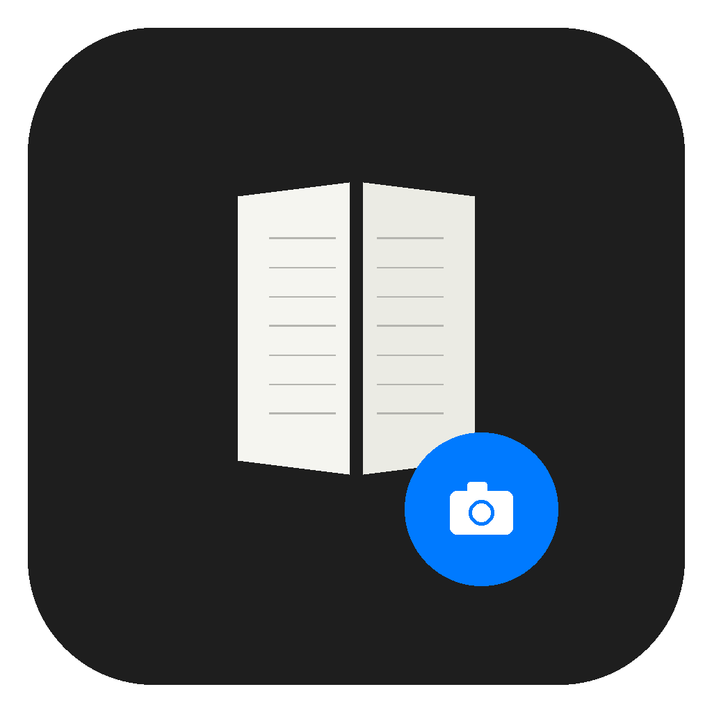

# Kindle Capture

Kindle アプリのウィンドウを自動キャプチャし、全ページのスクリーンショットを1つのPDFにまとめる macOS デスクトップアプリ。



## 機能

- Kindle ウィンドウの自動検出
- 自動ページ送り & スクリーンショット
- リアルタイムプレビュー & プログレスバー
- 途中停止対応
- PNG → PDF 一括変換

## 必要環境

- macOS
- Python 3.12+
- Kindle アプリ

## インストール

### DMG から（推奨）

[Releases](../../releases) から `.dmg` をダウンロードし、`Kindle Capture.app` を Applications にドラッグ&ドロップ。

### ソースから

```bash
python -m venv .venv
.venv/bin/pip install -r requirements.txt

# GUI アプリとして起動
.venv/bin/python kindle_capture_app.py

# CLI として使う場合
.venv/bin/python kindle_capture.py --pages 327
```

## ビルド

```bash
# .app をビルド
.venv/bin/python setup.py py2app

# DMG インストーラーを作成
bash create_dmg.sh
```

## CLI オプション

```
--pages     総ページ数（必須）
--start     開始ページ番号（デフォルト: 1）
--direction ページ送り方向 left/right（デフォルト: right）
--delay     ページ送り後の待ち秒数（デフォルト: 1.0）
--output    出力PDFファイル名
--outdir    PNG保存先ディレクトリ
```

## 権限

初回起動時に以下の macOS 権限が必要です：

- **画面収録** — スクリーンショットの撮影
- **アクセシビリティ** — Kindle のウィンドウ操作・キー送信
